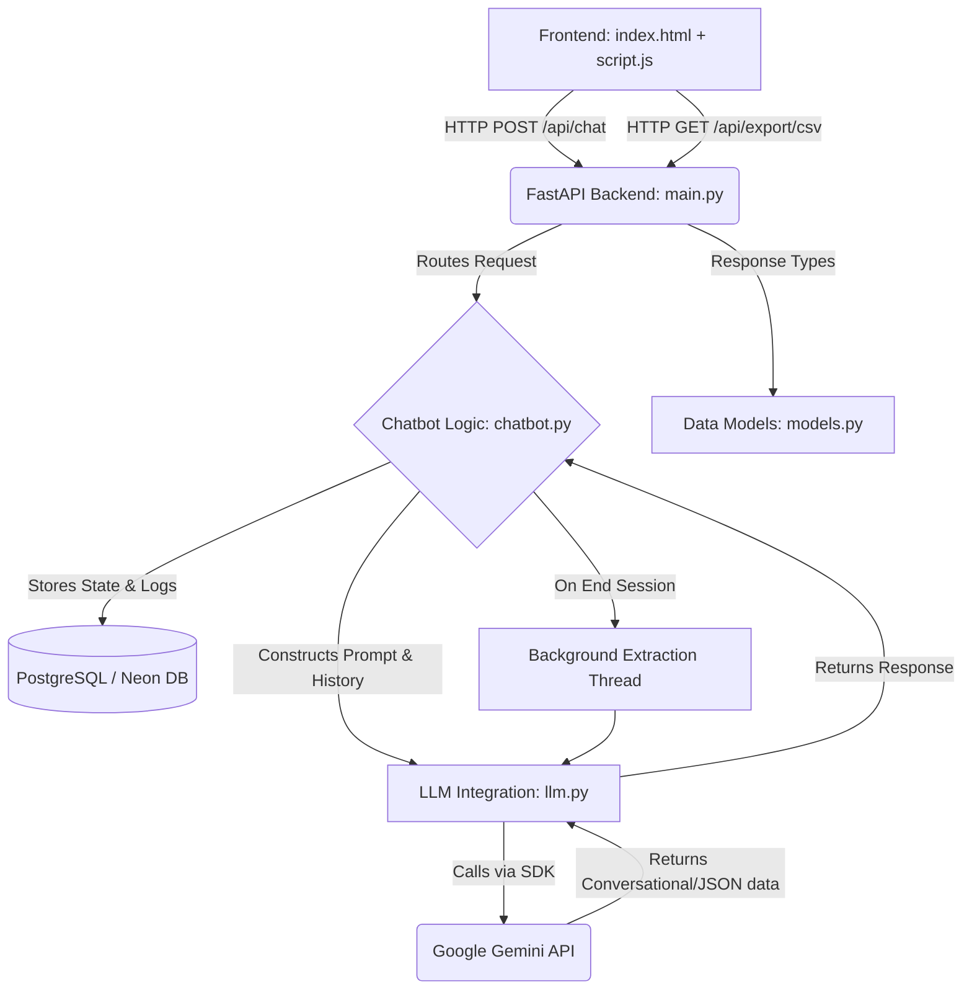

# HeuriSense Feedback Chatbot

## Project Overview

HeuriSense is a controlled conversational AI feedback system. It acts as an intelligent interviewer, collecting structured user feedback on image generation interactions. The system maintains a strict conversational flow with predefined guardrails, accepts text and image inputs, and extracts structured data from the conversation to be exported into a CSV format. 

The application utilizes a dark-mode, glassmorphism-inspired frontend aesthetics with a robust FastAPI python backend integrating the latest Google Gemini models.

---

## Architecture & Flowchart



### Component Details

- **`static/index.html`**: The structure of the web UI. Includes headers with action buttons, the chat transcript area, and an input/upload bar.
- **`static/style.css`**: The stylesheet implementing a premium dark theme tailored with translucent glassmorphism effects and dynamic animations.
- **`static/script.js`**: Client-side logic for rendering chat messages, handling image file uploads, and integrating sequentially with the FastAPI backend.
- **`main.py`**: The entrypoint for the FastAPI application. Exposes API endpoints for `/api/chat/init`, `/api/chat`, and `/api/export/csv`, while simultaneously serving the frontend static files.
- **`chatbot.py`**: The core conversational state manager. Maintains conversation histories (`ConversationLog`) under different `FeedbackSession` instances. It detects when conversations end, and triggers background data extraction routines to convert raw logs to structured fields.
- **`llm.py`**: The integration layer holding interactions with the Gemini API. Implements distinct prompts tailored for responsive conversation generation and post-session structured JSON extraction.
- **`models.py`**: Pydantic models for ensuring strict type validation of inputs and outputs in FastAPI routes.
- **`db.py`**: Manages the connection to the PostgreSQL database (e.g., Neon) for persisting user accounts and chat sessions.
- **`auth.py`**: Handles user authentication, including JWT token generation and robust password hashing using bcrypt.

---

## Prerequisites

- Python 3.9+
- A Google Gemini API Key
- A PostgreSQL database (e.g., Neon)

## Setup & Installation

1. **Clone the repository or navigate to the project folder:**
   ```bash
   cd "e:\AI\New folder"
   ```

2. **Create and activate a virtual environment:**
   ```bash
   python -m venv venv
   # On Windows:
   venv\Scripts\activate
   # On macOS/Linux:
   source venv/bin/activate
   ```

   Ensure you have the necessary libraries installed using the provided requirements file:
   ```bash
   pip install -r requirements.txt
   ```

   Create a `.env` file in the root folder containing your required keys:
   ```env
   GEMINI_API_KEY=your_gemini_api_key_here
   DATABASE_URL=your_postgresql_database_url_here
   JWT_SECRET=your_super_secret_jwt_key
   ```

## Running the Application

1. **Start the FastAPI Backend server:**
   ```bash
   uvicorn main:app --reload
   ```
2. **Access the Web Interface:**
   Open your preferred web browser and navigate to:
   [http://localhost:8000](http://localhost:8000)

## How to Use Output

1. **Conduct a Feedback Session:** Provide answers dynamically to the assistant, uploading images via the input box if necessary. 
2. **End the Session:** Upon conversational conclusion (e.g. "Thank you for your feedback"), the backend will automatically spin up background threads to compress and structure the chat logs.
3. **Export to CSV:** Use the "Export" functionality in the UI (or hit `/api/export/csv`) to download an organized spreadsheet mapped to specific KPIs like Intent, Expected Result, Performance Ratings, and Sentiments.
