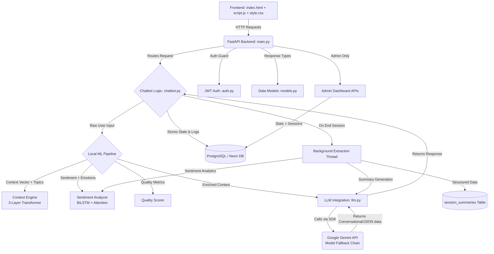
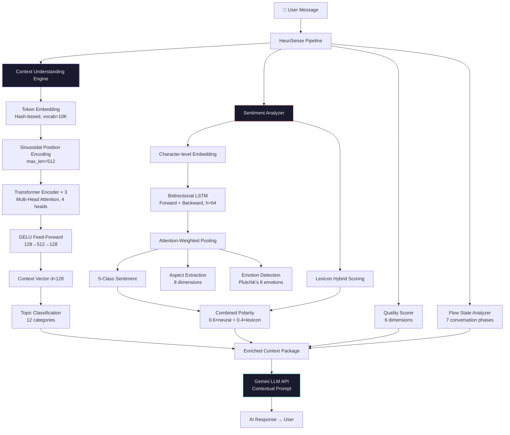
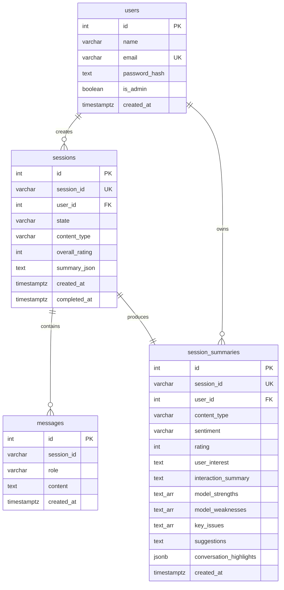

# 🧠 HeuriSense — Intelligent AI Feedback Collection System

## Project Overview

HeuriSense is a controlled conversational AI feedback system built on a **hybrid local ML + cloud LLM architecture**. It acts as an intelligent interviewer, collecting structured user feedback on AI-generated content across multiple modalities — images, documents, audio, video, and text. The system maintains a strict conversational flow with predefined guardrails, accepts multimodal inputs, performs real-time context understanding and sentiment analysis through a local transformer-based ML pipeline, and extracts structured data from the conversation for admin analytics and CSV export.

The application features a dark-mode, glassmorphism-inspired frontend ("Luminous Void" design system) with a robust FastAPI Python backend integrating the latest Google Gemini models, a dedicated admin dashboard with role-based access control, and a PostgreSQL-backed analytics layer.

<p align="center">
  
  
  
  
  
  
</p>

---

## Architecture & Flowchart



### Component Details

| File | Description |
|------|-------------|
| **`static/index.html`** | The structure of the web UI. Includes the auth overlay, navigation bar, upload section with file-type chips, chat transcript area, summary view, personal dashboard, admin dashboard with KPI cards, and account management. |
| **`static/style.css`** | The stylesheet implementing the "Luminous Void" design system — a premium dark theme with translucent glassmorphism effects, gradient accents, and dynamic micro-animations. |
| **`static/script.js`** | Client-side logic for rendering chat messages, handling multimodal file uploads (with 10 MB limit), admin tab visibility control, force-end session, and integrating with the FastAPI backend via JWT-authenticated requests. |
| **`main.py`** | The entrypoint for the FastAPI application. Exposes API endpoints for `/api/chat/init`, `/api/chat`, `/api/chat/end`, `/api/summary/{id}`, `/api/dashboard`, `/api/admin/stats`, and `/api/admin/sessions`, while simultaneously serving frontend static files (Vercel-compatible). |
| **`chatbot.py`** | The core conversational state manager. Maintains conversation histories (`ConversationLog`) under different `FeedbackSession` instances. Detects when conversations end, and triggers background data extraction routines to convert raw logs into structured fields stored in `session_summaries`. |
| **`llm.py`** | The integration layer for interactions with the Gemini API. Implements a **model fallback chain** (`gemini-2.0-flash` → `gemini-2.0-flash-lite` → `gemini-2.5-flash`) with automatic retry on rate limits. Contains distinct prompts for conversational generation and post-session structured JSON extraction. |
| **`models.py`** | Pydantic models for ensuring strict type validation of inputs and outputs across all FastAPI routes. |
| **`db.py`** | Manages the PostgreSQL connection (Neon), schema creation with migrations, and auto-seeds the admin account on startup. |
| **`auth.py`** | Handles user authentication (signup/login), JWT token generation with `is_admin` flag, bcrypt password hashing with SHA-256 pre-hash, and the `require_admin` dependency for protecting admin endpoints. |

---

## ML Model Architecture

The local ML pipeline (`ml_model/`) is a custom-built NLP system that processes user input before it reaches the Gemini API, enriching it with contextual understanding, sentiment signals, and quality metrics.

### Pipeline Flow



### ML Component Details

| File | Architecture | Purpose |
|------|-------------|---------|
| **`ml_model/context_engine.py`** | 3-layer Transformer Encoder with Multi-Head Self-Attention (4 heads, d_model=128), GELU Feed-Forward (512 hidden), Sinusoidal Position Encoding | Encodes conversational text into dense context vectors. Classifies input into 12 topic categories (quality_feedback, usability_concern, feature_request, etc.). Computes conversation coherence scores. |
| **`ml_model/sentiment_analyzer.py`** | Bidirectional LSTM (hidden=64) with Attention Head, Aspect Extractor (8 dims), Emotion Detector (Plutchik's 8), Sentiment Lexicon (positive/negative/intensifier/negator) | Performs 5-class sentiment classification (Very Negative → Very Positive) using hybrid neural-lexicon scoring. Extracts aspect-level quality signals and emotion distributions per message. Tracks sentiment trajectory across turns. |
| **`ml_model/pipeline.py`** | Orchestrator combining Context Engine + Sentiment Analyzer + Quality Scorer (6 dims) + Flow Analyzer (7 phases) | Unified interface that processes raw user input into enriched context packages. Generates full session analytics including model strengths, weaknesses, engagement curves, and topic evolution. |

### Model Parameters

| Parameter | Value |
|-----------|-------|
| Transformer d_model | 128 |
| Attention Heads | 4 |
| Transformer Layers | 3 |
| FFN Hidden Size | 512 |
| BiLSTM Hidden Size | 64 |
| Vocabulary Size | 10,000 |
| Max Sequence Length | 512 |
| Sentiment Classes | 5 |
| Aspect Dimensions | 8 (accuracy, speed, quality, usability, reliability, clarity, completeness, relevance) |
| Emotion Categories | 8 (joy, trust, anticipation, surprise, sadness, disgust, anger, fear) |
| Topic Categories | 12 |
| Hybrid Scoring | `polarity = 0.6 × neural + 0.4 × lexicon` |

---

## Database Schema



---

## Project Structure

```
feedback-heurisense/
├── main.py                    # FastAPI application entrypoint & static file serving
├── chatbot.py                 # Conversation state manager & session orchestration
├── llm.py                     # Gemini API integration with model fallback chain
├── auth.py                    # JWT authentication & admin authorization
├── db.py                      # PostgreSQL schema, migrations & admin seeding
├── models.py                  # Pydantic request/response models
│
├── ml_model/                  # 🧠 Local ML Pipeline (NumPy-based)
│   ├── __init__.py            # Package exports
│   ├── context_engine.py      # Transformer-based context understanding (3L, 4H)
│   ├── sentiment_analyzer.py  # BiLSTM + Attention sentiment & emotion analysis
│   └── pipeline.py            # Unified ML pipeline orchestrator
│
├── static/                    # Frontend assets
│   ├── index.html             # SPA with auth, upload, interview, summary, admin
│   ├── style.css              # Luminous Void design system (glassmorphism)
│   └── script.js              # Client-side application logic
│
├── requirements.txt           # Python dependencies
├── vercel.json                # Vercel serverless deployment config
├── .python-version            # Python version pin (3.12)
└── .env                       # Environment variables (not committed)
```

---

## Prerequisites

- Python 3.10+
- A Google Gemini API Key ([Get one here](https://aistudio.google.com/apikey))
- A PostgreSQL database (e.g., [Neon](https://neon.tech))

## Setup & Installation

1. **Clone the repository:**
   ```bash
   git clone https://github.com/Kshitij-2608/feedbackai.git
   cd feedbackai
   ```

2. **Create and activate a virtual environment:**
   ```bash
   python -m venv venv
   # On Windows:
   venv\Scripts\activate
   # On macOS/Linux:
   source venv/bin/activate
   ```

3. **Install dependencies:**
   ```bash
   pip install -r requirements.txt
   ```

4. **Create a `.env` file** in the root folder:
   ```env
   GEMINI_API_KEY=your_gemini_api_key_here
   DATABASE_URL=your_postgresql_database_url_here
   JWT_SECRET=your_super_secret_jwt_key
   ```

---

## Running the Application

1. **Start the FastAPI backend server:**
   ```bash
   uvicorn main:app --reload
   ```

2. **Access the Web Interface:**
   Open your browser and navigate to: [http://localhost:8000](http://localhost:8000)

---

## How to Use

1. **Sign Up / Login:** Create an account or sign in. The system uses JWT-based authentication.

2. **Upload Content:** Navigate to the Upload section, select a file type (Image, Document, Audio, Video, Text), and upload a file (up to 10 MB). Click "Begin AI Interview" to start.

3. **Conduct a Feedback Session:** Answer the AI interviewer's questions naturally. The local ML model analyzes your responses in real-time for context and sentiment while the Gemini API generates contextual follow-up questions.

4. **End the Session:** Sessions end automatically when the AI detects conclusion phrases, or click the **"End Session"** button to force-end at any time. The backend spins up a background thread to compress and structure the chat logs.

5. **View Summary:** After session completion, view your structured summary including sentiment analysis, key issues, ratings, conversation highlights, and suggestions.

6. **Personal Dashboard:** View all past sessions with their status and ratings.

---

## Admin Dashboard

The admin dashboard is accessible only to the designated admin account:

| Field | Value |
|-------|-------|
| **Email** | `admin@heurisense.ai` |
| **Password** | `HeuriAdmin@2026` |

### Admin Features
- **KPI Cards:** Total interactions, avg. confidence score, completion rate, total users
- **Content Type Filtering:** Filter all sessions by modality (image, document, audio, video, text)
- **Session Analytics:** View structured summaries with sentiment, model strengths/weaknesses, and engagement data
- **Role-Based Access:** Admin endpoints return `403 Forbidden` for non-admin users

---

## API Reference

| Method | Endpoint | Auth | Description |
|--------|----------|------|-------------|
| `POST` | `/api/auth/signup` | ✗ | Create new user account |
| `POST` | `/api/auth/login` | ✗ | Login and receive JWT token |
| `GET` | `/api/auth/me` | ✓ | Get current user profile |
| `PUT` | `/api/auth/me` | ✓ | Update profile (name, email, password) |
| `GET` | `/api/chat/init` | ✓ | Initialize a new interview session |
| `POST` | `/api/chat` | ✓ | Send message and receive AI response |
| `POST` | `/api/chat/end` | ✓ | Force-end a session and trigger summary |
| `GET` | `/api/summary/{id}` | ✓ | Get structured session summary |
| `GET` | `/api/dashboard` | ✓ | Get user's session history |
| `GET` | `/api/admin/stats` | 🔒 Admin | Aggregated KPI statistics |
| `GET` | `/api/admin/sessions` | 🔒 Admin | All sessions with content-type filter |

---

## Deployment

The application is deployed on **Vercel** as a Python serverless function with the following model fallback chain for high availability:

```
gemini-2.0-flash (1500 RPD) → gemini-2.0-flash-lite → gemini-2.5-flash (20 RPD)
```

**Live URL:** [https://feedbackai-beta.vercel.app](https://feedbackai-beta.vercel.app)

Environment variables (`GEMINI_API_KEY`, `DATABASE_URL`, `JWT_SECRET`) must be configured in **Vercel → Project Settings → Environment Variables**.

---

<p align="center">
  <strong>Built with 🧠 by the HeuriSense Team</strong>
</p>
